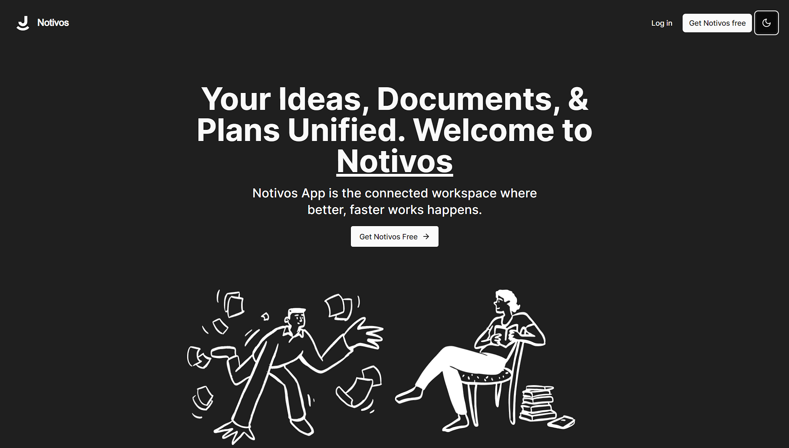

# Notivos - Your Personal Note Taking App

Check out the [Notivos App](https://notivos.vercel.app/) to get started.

## Introduction

**Notivos** is a simple, yet powerful note taking app designed to make note taking easy and efficient. Whether you're jotting down ideas, making a shopping list, or keeping a diary, Notivos is here to help!

## Features

- **Simple Interface**: Notivos has a clean and intuitive interface that makes navigation a breeze.
- **Rich Text Support**: Bold, italicize, underline, create bullet lists, and more with our rich text editor.
- **Search and Organization**: Easily search for notes and organize them with tags and folders.
- **Publish Option**: Get a link to share your note with others.
- **Trash**: Move notes to trash with options to restore or delete forever.

## Technologies Used

- **NextJs 14**
- **ReactJs**
- **Typescript**
- **Tailwind CSS**
- **Shadcn UI**
- **Clerk**
- **React Emoji Picker**
- **Convex Database**
- **Blocknote Editor**
- And much more...
